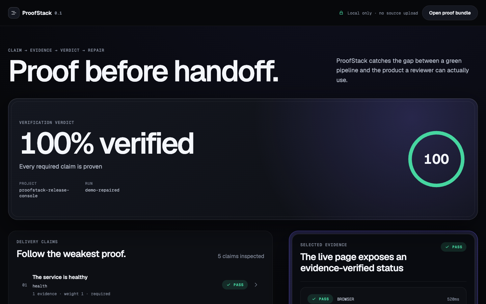
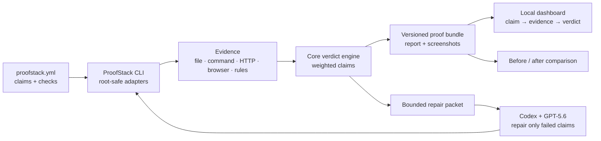

# Codex ProofStack

**Make “done” provable.** ProofStack turns delivery claims into local evidence, explicit verdicts,
bounded Codex repair prompts, and a before/after proof trail.

[Live demo](https://thestack-ai.github.io/codex-proofstack/) ·
[Demo script](docs/demo-script.md) ·
[Submission copy](docs/submission.md)



ProofStack is an OpenAI Build Week entry in **Developer Tools**. It targets a specific failure mode
in agentic software work: tests can be green while the rendered product is still wrong. The included
demo proves that gap with a broken run scoring **38**, then shows the repaired run scoring **100**.

## 30-second judge path

1. Open the [hosted demo](https://thestack-ai.github.io/codex-proofstack/). No account or API key is
   required.
2. Read the default `38 → 100` comparison and the two claims marked `FAIL → PASS`.
3. Select **The live page exposes an evidence-verified status** and inspect its browser screenshot.
4. Scan the claim-level comparison to see what changed and what stayed proven.
5. Click **Copy for Codex** to copy the exact bounded repair packet that closed the original gaps.

Everything in the hosted demo is static sample evidence. Local reports stay in the browser when
opened from disk; ProofStack does not upload source code.

## Run locally

Requirements: Node.js 20+, pnpm 11+, and a Chromium build installed through Playwright.

```bash
pnpm install
pnpm exec playwright install chromium
pnpm verify
pnpm --filter @proofstack/dashboard dev
```

Open the printed local URL. The dashboard loads the included broken and repaired bundles by default.
To inspect your own run, choose **Open proof bundle** and select its
`.proofstack/<run-id>/proofstack-report.json` file.

To run the complete demonstration from source:

```bash
pnpm build
node examples/proofstack-demo/run-demo.mjs broken
node examples/proofstack-demo/run-demo.mjs repaired
```

Expected result:

```text
broken  → 38%  → 2 required repair claims
repaired → 100% → 0 required repair claims
```

No OpenAI API key is required for the CLI, dashboard, fixtures, or verification suite. A ChatGPT
Codex session is only needed when a developer chooses to hand the generated repair packet to Codex.

### Supported platforms

| Surface | Support for this release |
|---|---|
| Hosted dashboard | Current desktop and mobile browsers; Chromium is the verified reference |
| Local dashboard | Node.js 20+ on macOS or Linux |
| CLI | Tested on macOS; designed for Node.js 20+ on macOS and Linux |
| Browser evidence | Playwright Chromium |
| Windows | Not claimed for the hackathon release |

The hosted demo is the judge path that requires no checkout, build, credentials, or test account.

## Why it exists

Coding agents are good at producing changes and reporting that checks passed. The weak point is the
handoff: “tests passed,” “the page works,” and “the artifact exists” are often claims with no shared,
inspectable proof.

ProofStack makes those claims executable. A project declares what must be true in `proofstack.yml`.
The CLI gathers evidence from the file system, commands, HTTP, the rendered browser, and project
rules. The core scores required claims, writes a versioned proof bundle, and produces a repair prompt
limited to the non-passing claims. Rerunning the same contract creates the before/after trail.

The key design choice is that **evidence outranks narration**. A green unit test cannot compensate for
a failed browser claim with a higher delivery weight.

## How the proof contract works

```yaml
version: 1
project: release-console
allowedCommands: [node]
claims:
  - id: tests
    title: The health test passes
    weight: 1
    checks:
      - id: health-command
        type: command
        command: node
        args: [test.mjs]

  - id: visible-status
    title: The live page exposes an evidence-verified status
    weight: 3
    checks:
      - id: status-browser
        type: browser
        url: http://127.0.0.1:4173
        role: status
        name: Evidence verified
        screenshot: release-console.png
```

Run it from the checkout:

```bash
node packages/cli/dist/main.js verify --cwd /path/to/project --json
```

| Check | What it proves | Important options |
|---|---|---|
| `file` | A project-root file exists and optionally contains required text | `path`, `contains` |
| `command` | An allowlisted executable exits successfully | `command`, `args`, `timeoutMs` |
| `http` | An endpoint matches status, content, and optional latency | `url`, `status`, `contains`, `maxLatencyMs` |
| `browser` | A rendered page exposes text or an accessible role/name | `url`, `text`, `role`, `name`, `screenshot` |
| `rules` | Project instructions contain required delivery rules | `path`, `mustContain` |

Verdicts are `pass`, `fail`, or `unknown`. A weighted score communicates progress, but any required
claim that is not `pass` keeps the run incomplete.

| Exit code | Meaning |
|---:|---|
| `0` | Every required claim passed |
| `1` | Verification ran, but at least one required claim did not pass |
| `2` | The contract, project root, or verification process was invalid |

## Architecture



The repository is a pnpm workspace:

- `packages/core`: strict schemas, scoring, redaction, comparison, and bundle validation.
- `packages/cli`: project resolution, five evidence adapters, orchestration, secure report writing,
  and the `proofstack` executable.
- `apps/dashboard`: local JSON import, claim/evidence inspection, run comparison, and repair copy.
- `examples/proofstack-demo`: intentionally broken and repaired release-console fixtures.
- `test/integration`: assertions that a green test can coexist with a failed rendered product.

## Privacy and safety

- **Local-first:** the CLI writes under the verified project root and the dashboard parses selected
  JSON in the browser. There is no source-upload service.
- **Bounded commands:** contracts must explicitly allow each executable. Commands run without a
  shell and with a timeout.
- **Root containment:** file, rule, output, and screenshot paths are checked against the project
  root.
- **Evidence redaction:** captured text is sanitized for common secret forms before it enters a
  bundle.
- **Untrusted evidence:** the repair packet tells Codex to treat evidence as data, preserve passing
  behavior, and modify only listed non-passing claims.
- **Honest uncertainty:** unreachable HTTP/browser targets produce `unknown`; ProofStack does not
  convert missing proof into success.

Generated evidence can still contain project-specific text. Review a bundle before publishing it;
redaction is a safety layer, not a guarantee that every private value is detectable.

## How Codex and GPT-5.6 were used

ProofStack was designed and implemented in Codex with GPT-5.6 as the coding partner for the core
hackathon session. Codex helped turn the initial “prove the handoff” idea into a strict contract,
implemented the schema and adapters test-first, generated the two-state fixture, built the dashboard,
and repeatedly drove the real CLI and browser surfaces.

Several decisions remained explicit human product choices: local-only evidence, no autonomous code
mutation, command allowlisting, required-claim failure semantics, evidence treated as untrusted data,
and a repair prompt constrained to the failed claims. GPT-5.6 then helped expose and fix failures that
unit tests alone missed, including responsive UI issues, reverse import semantics, non-deterministic
demo timing, and a packed CLI that initially depended on an unpublished workspace package.

The shipped runtime deliberately has no model call. It creates trustworthy context for Codex rather
than hiding another agent behind the verification step.

## Test and release verification

```bash
pnpm verify
```

That command runs formatting/lint checks, **46 unit and component tests**, strict TypeScript checks,
both live demo states, deterministic asset generation, the cross-package integration assertion, and
production builds. The release was also checked through:

- a packed CLI installed in a fresh temporary project, including `--help`, version, and a 100% run;
- browser QA at 375/390, 768, 1280, and 1440px with no horizontal overflow or console errors;
- keyboard focus, clipboard copy, reduced-motion, and long-identifier states;
- React Doctor 0.7.8 with a 100/100 result;
- two consecutive demo generations with an identical SHA-256 content hash.

## License

[MIT](LICENSE) © 2026 Duwon Park.
